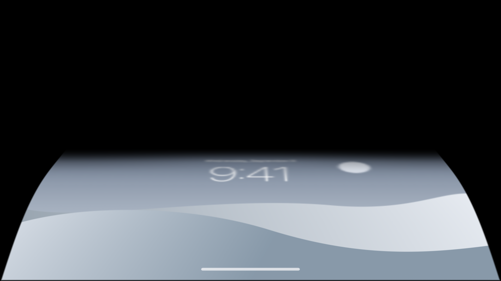
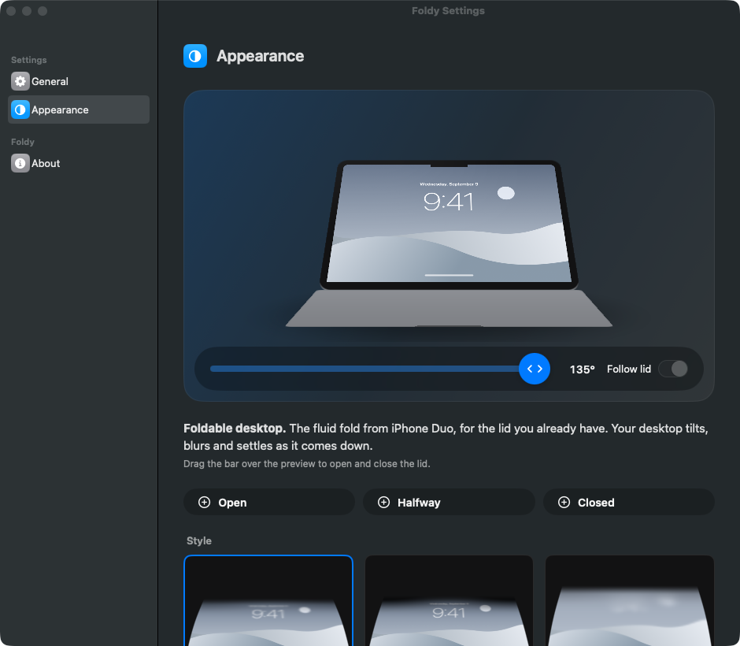

# Foldy

**Your desktop bends as you close the lid.** · [foldy on GitHub Pages](https://alexey1312.github.io/foldy/)

The fluid fold from iPhone Duo, for the MacBook you already have. As the lid comes
down, Foldy captures the desktop and draws it back as a sheet that tilts, bends,
blurs toward the top and falls into shadow. When the lid comes up, the desktop
clears with a soft click.

Foldy is an open, from-scratch re-creation of [Bendy](https://trybendy.app/):
a menu bar app for macOS, written in Swift with SwiftUI, Metal, ScreenCaptureKit
and IOKit. No account, no license key, no network code.

| The fold on the real display | Settings, with the drag-to-open preview |
| --- | --- |
|  |  |

## What it does

- **Lid sensor.** Reads the hinge angle from the Mac's own HID sensor (vendor
  `0x05AC`, product `0x8104`, Sensor page, Orientation usage). It registers for
  input reports and keeps a heartbeat poll that runs at 60 Hz only while the lid
  is moving and drops to 10 Hz once it settles.
- **Live desktop.** Captures the built-in display with ScreenCaptureKit, excluding
  Foldy's own windows, and uploads each frame straight to a mipmapped Metal texture.
- **The fold.** A 64×64 grid tilts about the hinge and, with the *Bend* slider,
  curls like a page so the base stays put and only the top folds back. The
  fragment shader blurs by mip level toward the top edge, shades the top corners,
  feathers the silhouette and rounds the corners. Progress follows the lid on a
  smoothstep, then a per-frame lerp, so a jumpy sensor still gives a fluid fold.
- **Three styles.** Silk, Shade and Frost, each with Perspective, Variable blur,
  Shadow, Bend and Frost on sliders. Set the angle where the desktop clears and
  the angle where the fold completes.
- **Take a closer look.** Settings shows a 3D MacBook, rendered by the same
  Metal code as the overlay, whose lid you open and close with a drag — the
  interaction from Apple's iPhone Duo page, with Open / Halfway / Closed /
  Silk / Shade / Frost chips.
- **Sound.** A synthesised click when the lid opens and the desktop clears.
- **Menu bar.** Lives in the menu bar. Pause, Try It Now (folds the real desktop
  once, down and back up), Settings, Quit. Click the fold or press Esc to clear
  it until the lid opens again.

## Requirements

- macOS 14 Sonoma or later.
- An Apple silicon MacBook with a lid angle sensor (MacBook Pro 2021 onward,
  MacBook Air M2 onward, or the 2019 16-inch MacBook Pro).
- Screen Recording permission, so the desktop can be captured. Without it Foldy
  folds a built-in sample wallpaper instead.

On a Mac without the sensor (a desktop, or an older laptop) everything except the
lid still works: the settings preview, the style thumbnails and *Try It Now*.

## Install

Grab `Foldy-x.y.z.dmg` or the zip from the
[releases page](https://github.com/alexey1312/foldy/releases) and drag Foldy to
Applications. The build is ad-hoc signed, not notarized, so macOS blocks the first
launch: open it once, then go to System Settings › Privacy & Security, scroll to the
message about Foldy and click **Open Anyway**. Or clear the quarantine flag first:

```bash
xattr -dr com.apple.quarantine /Applications/Foldy.app
```

On the first launch Foldy asks for Screen Recording and opens its General pane.
Allow it in System Settings, then choose **Relaunch Foldy** from the menu bar: macOS
gives the permission to a fresh process only. Until then Foldy folds a sample
wallpaper instead of the live desktop.

Releases are cut by `.github/workflows/release.yml` from a `v*` tag; CI on every
push builds the package, runs the tests and bundles the app.

## Build and run

Xcode 16 or later with the macOS 14 SDK. Everything is a Swift package.

```bash
make app          # swift build -c release, then wraps build/Foldy.app (ad-hoc signed)
open build/Foldy.app
```

Other targets:

```bash
make test         # unit tests for the angle curve, the HID report parser, the styles
make snapshot     # renders the fold and the MacBook preview to docs/snapshots/*.png
swift build       # debug build of every target
```

You can also open `Package.swift` in Xcode and run the `Foldy` scheme, but the
bare binary has no bundle identifier, so macOS keys the Screen Recording grant to
the path and the app will fold the sample wallpaper until you allow it in
System Settings › Privacy & Security › Screen Recording.

Launch at login uses `SMAppService`, which only works from an app bundle.

### Command-line switches

Useful while developing; none are needed to use the app.

| Switch | What it does |
| --- | --- |
| `--settings [--pane general\|appearance\|about]` | Opens Settings at launch |
| `--screenshot-settings out.png` | Opens Settings, captures the window, quits |
| `--screenshot-fold out.png` | Folds the sample wallpaper on the real display, captures the overlay, quits |

`foldy-snapshot` renders without a window:

```bash
.build/debug/foldy-snapshot --out fold.png --progress 0.7 --style frost
.build/debug/foldy-snapshot --out mac.png --scene macbook --lid 60 --background white
.build/debug/foldy-snapshot --out mine.png --scene macbook --lid 45 --source ~/Desktop/shot.png
```

## Layout

```
Sources/FoldyCore       The parts that need no window.
  FoldParameters.swift    Styles, parameters, the angle → progress curve.
  LidAngleReport.swift    The HID report format and a table of Macs with and without a lid.
  LidAngleSensor.swift    IOHIDManager: input reports plus an adaptive heartbeat poll.
  DisplayCapture.swift    ScreenCaptureKit stream of the built-in display, excluding Foldy.
  FoldShaders.swift       The Metal shaders, compiled once at launch from source.
  FoldGraphics.swift      Device, pipelines, texture cache.
  FoldRenderer.swift      The fold: grid mesh, smoothing, frame upload, offscreen or on-screen.
  MacBookScene.swift      The 3D MacBook for the preview; the fold renders to its screen.
  WallpaperArt.swift      The sample lock screen, drawn with CoreGraphics.
  FoldSound.swift         The click, synthesised with AVAudioEngine.
Sources/Foldy           The menu bar app.
  AppController.swift     Sensor + capture + overlay + sound, and the decisions between them.
  OverlayWindowController.swift  The full-screen window; click or Esc dismisses.
  Views/                  Settings panes, the drag-to-open slider, the Metal preview views.
Sources/FoldySnapshot   Renders PNGs of the fold and the preview.
Tests/FoldyCoreTests    Swift Testing suites.
Support/Info.plist      The app bundle's plist (LSUIElement, bundle id).
Scripts/bundle.sh       Builds Foldy.app from the SwiftPM product.
site/index.html         The landing page: the same fold in WebGL, scroll-driven, plus
                        the drag-to-open 3D lid. No build step, no dependencies.
```

## The landing page

`site/index.html` is a single file, published to GitHub Pages at
<https://alexey1312.github.io/foldy/> by `.github/workflows/pages.yml` on every
push to `main`. It ports the Metal shader to WebGL 2, so the MacBook at the top of
the page bends as you scroll exactly the way the app bends the desktop, and the
"Take a closer look" section swings a CSS 3D lid on its hinge with the fold on its
screen. Open the file in a browser, or serve the folder.

## Status

Built and checked on a Mac mini (M4 Pro, macOS 26.6, Xcode 27 beta):

- `swift build`, `swift test` (12 tests) and `make app` pass.
- The renderer, the 3D preview, the settings window and the full-screen overlay
  were exercised with the sample wallpaper: `--screenshot-fold` runs *Try It Now*
  on the real display and captures the result (`docs/fold-overlay.png`).

Not yet checked, because this machine has no lid and no Screen Recording grant:

- Reading the real sensor. The report layout (feature report 1, bytes 1–2,
  little-endian degrees) follows [samhenrigold/LidAngleSensor](https://github.com/samhenrigold/LidAngleSensor),
  whose author tested it on an M4 MacBook Pro; that project's issues report some
  M1/M2 machines exposing the device on a vendor-specific usage page instead,
  which Foldy reports as "found but not readable".
- Whether the sensor pushes input reports. If it does not, the heartbeat poll
  carries the angle on its own.
- The live ScreenCaptureKit path on a granted machine.

## Credits

- Apple's [iPhone Duo](https://www.apple.com/iphone-duo/), for the fold and the
  "drag below to open and close" interaction.
- [Bendy](https://trybendy.app/) by Adrian Abelarde, the app that first put the
  fold on a MacBook lid. Foldy borrows its idea, its three style names and the
  shape of its landing page; the code is new.
- [LidAngleSensor](https://github.com/samhenrigold/LidAngleSensor) by Sam Henri
  Gold, for the HID details of the hinge sensor.

MIT licensed. See `LICENSE`.
